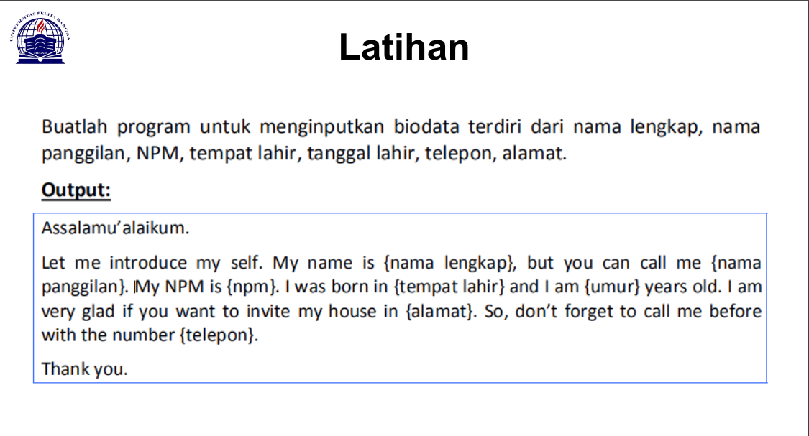
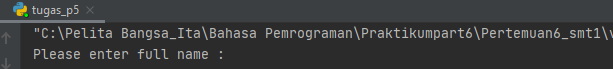
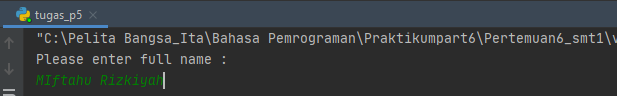

# Pertemuan6_ Tugas Bahasa Pemrograman

Repository ini dibuat untuk memenuhi tugas bahasa pemrograman pertemuan 6 <br> <br>
Nama : Miftahu Rizkiyah

NIM  : 312010014

Kelas : TI.20.B.1
<br>
============================
<br>


## Pertemuan 5 - Tugas Bahasa Pemrograman

Pada pertemuan 5 Bahasa Pemrograman saya diberikan tugas oleh dosen untuk membuat aplikasi biodata dengan python (seperti gambar dibawah ini)
<br>
saat ini saya akan menjelaskan hasil dari tugas tersebut.<br>
Berikut *source code* nya atau klik link berikut ( [Tugas_5 python](tugas_p5.py) ): <br>
``` python
print("Please enter full name : ")
fullname=input()

print("please insert your Nickname : ")
nickname=input()

print("please enter your NPM : ")
NPM=input()

print("please enter your Born place : ")
bornplace=input()

print("please insert your age : ")
age=input()

print("please enter your home address : ")
address=input()

print("please enter your phone number : ")
phonenumber=input()


print("\nAssalamualaikum Wr, Wb.")
print(f"\nLet me introduce my self. My name is {fullname}, but you can call me {nickname}. My NPM is {NPM}. I was Born in {bornplace} and i am {age} years old. I am very glad if you want to invite my house in {address}. So, don't forget to call me before with the number {phonenumber}.")
print("\nThank you.")
print("\n")
```
Berikut penjelasannya :<br>
``` python
print("Please enter full name : ")
```
source code diatas berfungsi untuk mencetak hasil / output berupa "***Please enter full name :***" (Seperti gambar dibawah ini)<br>
<br>
* untuk source code berikutnya adalah inputan atau membuat variable, seperti syntax dibawah ini :
```python
fullname=input()
```
Ket : <br>
-Variable adalah sebuah wadah penyimpanan data pada program yang akan digunakan selama program itu berjalan yang berfungsi sebagai variable dalam source code diatas adalah ***fullname***.
-Fungsi **input()* adalah untuk memasukan nilai dari layar console di command prompt, lalu kemudian mengembalikan nilai saat kita menekan tombol enter *(newline)*<br>
<br>

<br>
Pada gambar diatas hasil dari inputan tersebut berwarna **hijau**<br><br>
-untuk memasukan perintah lain seperti **nick name, NPM, born place, age, home address, and phone number** mengikuti perintah yang sama seperti memasukan *fullname* <br>

 


