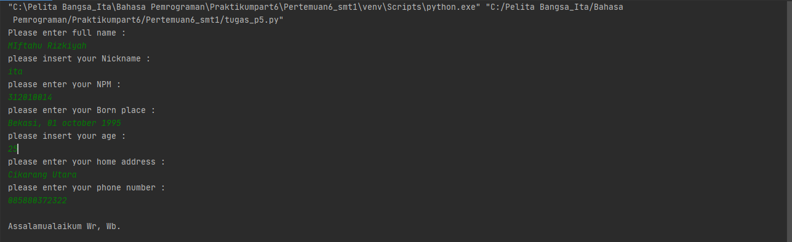
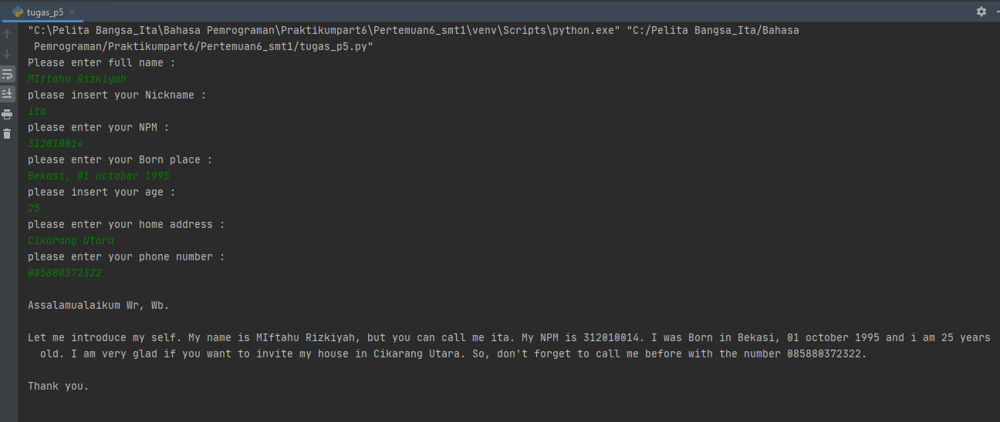
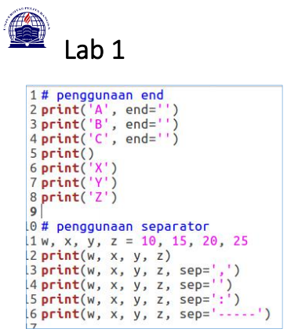
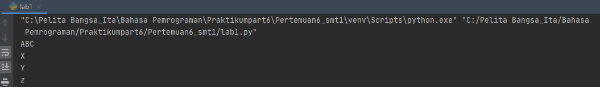
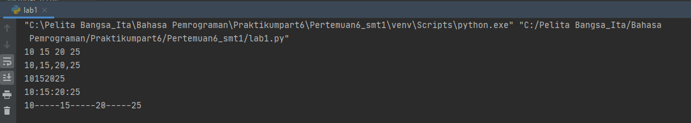

# Pertemuan6_ Tugas Bahasa Pemrograman

Repository ini dibuat untuk memenuhi tugas bahasa pemrograman pertemuan 6 <br> <br>
Nama : Miftahu Rizkiyah

NIM  : 312010014

Kelas : TI.20.B.1
<br>
==========================
DAFTAR ISI <br>
| No | Description | Link |
| --- | ----- | -----|
| 1 | Tugas Pertemuan 5 | [Tugas_pertemuan5](#pertemuan-5---tugas-bahasa-pemrograman)
| 2 | Tugas Pertemuan 6 Lab 1| [Tugas_Part6_Lab1](#pertemuan-6---lab-1)
| 3 | Tugas pertemuan 6 Lab 2| [Tugas_Part6_Lab2](#pertemuan-6---lab-2)
<br>


## Pertemuan 5 - Tugas Bahasa Pemrograman

Pada pertemuan 5 Bahasa Pemrograman saya diberikan tugas oleh dosen untuk membuat aplikasi biodata dengan python (seperti gambar dibawah ini)
<br>
saat ini saya akan menjelaskan hasil dari tugas tersebut.<br>
Berikut *source code* nya atau klik link berikut ( [Tugas_5 python](tugas_p5.py) ): <br>
``` python
print("Please enter full name : ")
fullname=input()

print("please insert your Nickname : ")
nickname=input()

print("please enter your NPM : ")
NPM=input()

print("please enter your Born place : ")
bornplace=input()

print("please insert your age : ")
age=input()

print("please enter your home address : ")
address=input()

print("please enter your phone number : ")
phonenumber=input()


print("\nAssalamualaikum Wr, Wb.")
print(f"\nLet me introduce my self. My name is {fullname}, but you can call me {nickname}. My NPM is {NPM}. I was Born in {bornplace} and i am {age} years old. I am very glad if you want to invite my house in {address}. So, don't forget to call me before with the number {phonenumber}.")
print("\nThank you.")
print("\n")
```
Berikut penjelasannya :<br>
``` python
print("Please enter full name : ")
```
source code diatas berfungsi untuk mencetak hasil / output berupa "***Please enter full name :***" <br>
untuk menampilkan input string, saya menggunakan *tanda petik dua* didalam fungsi input(), sedangkan jika saya ingin menampilkan output/hasil berupa angka/interger saya tidak perlu menggunakan *tanda petik dua*. contohnya :
```python
print("Nama saya adalah ...")
print(12345)
```
(Seperti gambar dibawah ini)

<br>
* untuk source code berikutnya adalah inputan atau membuat variable, seperti syntax dibawah ini :
```python
fullname=input()
```
Ket : <br>
-Variable adalah sebuah wadah penyimpanan data pada program yang akan digunakan selama program itu berjalan yang berfungsi sebagai variable dalam source code diatas adalah ***fullname***.
-Fungsi **input()* adalah untuk memasukan nilai dari layar console di command prompt, lalu kemudian mengembalikan nilai saat kita menekan tombol enter *(newline)*<br>


<br>
Pada gambar diatas hasil dari inputan tersebut berwarna **hijau**<br><br>
-untuk memasukan perintah lain seperti **nick name, NPM, born place, age, home address, and phone number** mengikuti perintah yang sama seperti memasukan *fullname* <br>
<br>
* Langkah kali ini saya akan menampilkan output yang diminta oleh Dosen,<br>
Output pertama yang diminta dosen adalah menampilkan salam, yaitu dengan mengetikan syntax/source code berikut :
```python
print("\n\n Assalamu'alaikum")
```
Ket :
1. Fungsi ***\n*** pada source code diatas adalah untuk memberi baris baru / enter / *newline*
2. Fungsi print(), seperti dijelaskan pada point *Output* diatas
Hasil dari source code diatas adalah seperti gambar dibawah ini :
<br><br>
*Langkah terakhir adalah menampilkan dari semua inputan diatas. Dengan mengetikkan source code berikut : <br>
```python
print("\nAssalamualaikum Wr, Wb.")
print(f"\nLet me introduce my self. My name is {fullname}, but you can call me {nickname}. My NPM is {NPM}. I was Born in {bornplace} and i am {age} years old. I am very glad if you want to invite my house in {address}. So, don't forget to call me before with the number {phonenumber}.")
print("\nThank you.")
```

Ket :
1. Fungsi huruf ***f*** pada perintah **print(f"...")** adalah fungsi print yang dapat memudahkan programmer untuk mencetak statement dalam satu baris dibandingkan dengan metode yang lama yaitu memisahkan string dan variable dengan simbol koma ( , ) atau ( + )<br>
2. Sedangkan fungsi {} pada output tersebut adalah untuk menampilkan hasil dari variable<br>
Hasil dari output tersebut adalah :


<br>
---
<br>

## Pertemuan 6 - Lab 1

Pada tugas pertemuan 6 - Lab 1 saya diberikan tugas oleh dosen untuk mempelajari OPerator Aritmatika menggunakan bahasa pemrograman python. Berikut source code yang diberikan oleh Dosen :
<br>
```python
#penggunaan end
print('A', end='')
print('B', end='')
print('C', end='')
print()
print('X')
print('Y')
print('z')

#penggunaan separator
w, x, y, z = 10, 15, 20, 25
print(w, x, y, z)
print(w, x, y, z, sep=',')
print(w, x, y, z, sep='')
print(w, x, y, z, sep=':')
print(w, x, y, z, sep='-----')
```
Kali ini saya akan menjelaskan materi yang diberikan oleh Dosen.<br>

*Penggunaan End
Penggunaan End digunakan untuk menambahkan karakter yang dicetak diakhir baris. Secara default penggunaan End adalah untuk ganti baris
```python
print('A', end='')
print('B', end='')
print('C', end='')
```

> Penggunaan print() digunakan untuk mencetak output, seperti syntax dibawah ini :
```python
print()
```

> Syntax dibawah ini digunakan untuk output berupa string
```python
print('X')
print('Y')
print('z')
```


Hasil dari source code tersebut adalah :<br>
<br>

*Penggunaan Separator
Separator adalah pemisah yang befungsi sebagai tanda pemisah antar objek yang dicetak. Defaultnya adalah tanpa spasi.<br>

>Pendeklarasian beberapa variable beserta nilainya
```python
w, x, y, z = 10, 15, 20, 25
```
>Menampilkan hasil untuk tiap variable dengan menggunakan pemisah koma ( , )
```python
print(w, x, y, z, sep=',')
```
>Menampilkan hasil untuk tiap variable tanpa menggunakan pemisah
```python
print(w, x, y, z, sep='')
```
>Menampilkan hasil untuk tiap variable dengan menggunakan pemisah titik dua ( : )
```python
print(w, x, y, z, sep=':')
```
>Menampilkan hasil untuk tiap variable dengan menggunakan pemisah strip/ dash ( ----- )
```python
print(w, x, y, z, sep='-----')
```

Hasil dari syntax / source code diatas adalah :

<br>

<br>
---
<br>

## Pertemuan 6 - Lab 2


 


